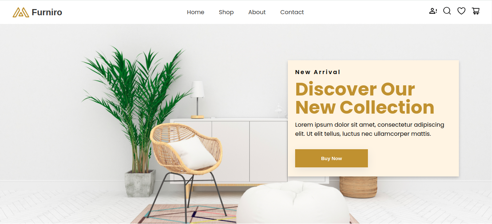

# React Furniro
This is a modern, responsive landing page for a furniture store, built using React JS and SCSS. The page showcases various furniture items with an elegant design, smooth transitions, and a user-friendly interface.

## Demo
You can view a live demo of the project [here](https://tegarsubkhan236.github.io/react-furniro/).

## Figma Reference
You can view a figma design of the project [here](https://www.figma.com/design/N5gkPhEmTvjQVBnYPhhEdA/eCommerce-Website-%7C-Web-Page-Design-%7C-UI-KIT-%7C-Interior-Landing-Page-(Community)?node-id=1-3&node-type=CANVAS&t=q0K09vYsdbCzpvan-0).
